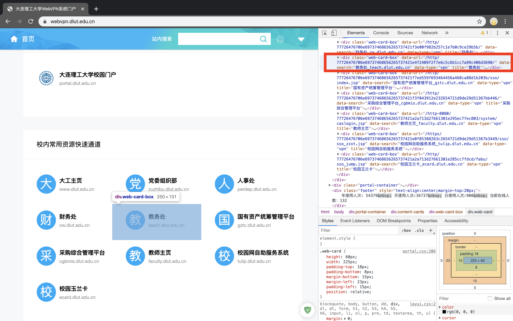

# WebVpn4DUT

##  What is this for? 

DUT 之前推出了 WebVpn 方便大家无法使用校园网时也能访问校内网站，但是它支持的网址有限。

它的原理是通过一个函数 encode 这个你要访问的网址，然后把编码出来的网址加在`webvpn.dlut.edu.cn/`后，就能访问校内才能访问的地址了。比如说在 WebVpn 里访问教务处，实际是访问的 https://webvpn.dlut.edu.cn/http/77726476706e69737468656265737421e4f2409f2f7e6c5c6b1cc7a99c406d3690/ 。

那么后面这串 777 开头的什么编码是怎么算出来的呢？比较奇葩的是，它之前把 encode 的函数放在了前端代码里，打开控制台就能看到。现在这份 encode 的代码已经从网站下掉了（幸运的是，这里有[备份](https://github.com/cjhahaha/webvpn4dut/blob/master/src/utils/encoder.js)），换成写死的 encode 后的网址（在 `data-url`）里。

## 项目结构

这是一个简单的由 [Create React App](https://github.com/facebook/create-react-app) 和 typescript 创建的项目，UI 很简单，支持 dark mode。

```
.
├── README.md
├── package.json
├── public
├── src
│   ├── App.scss
│   ├── App.tsx
│   ├── components
│   │   └── info.tsx
│   ├── hooks
│   │   └── useTheme.ts     // 用于支持 dark mode
│   ├── index.scss
│   ├── index.tsx
│   └── utils
│       ├── aes-js.js       // encode 算法
│       ├── encoder.d.ts    // 为了把 js 引入到 ts，定义一个 .d 文件
│       ├── encoder.js      // encode 算法
│       └── index.ts
└── tsconfig.json
```
